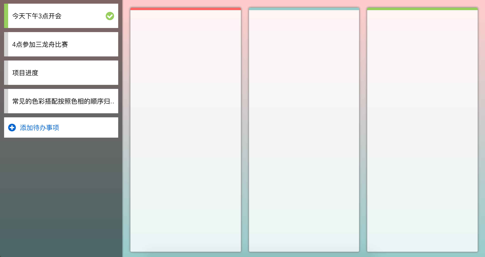

# todo

> todo web app

## Build Setup

``` bash
# install dependencies
npm install

# serve with hot reload at localhost:8080
npm run dev

# build for production with minification
npm run build
```
### 移动web端
<a href="http://wuchaofan.github.io/demo/todo/index.html#/">Demo（在手机上打开最佳）</a>


### PC web
<a href="http://wuchaofan.github.io/demo/todo/index.html#/pc">Demo（未做兼容，在Chrome上浏览）</a>


